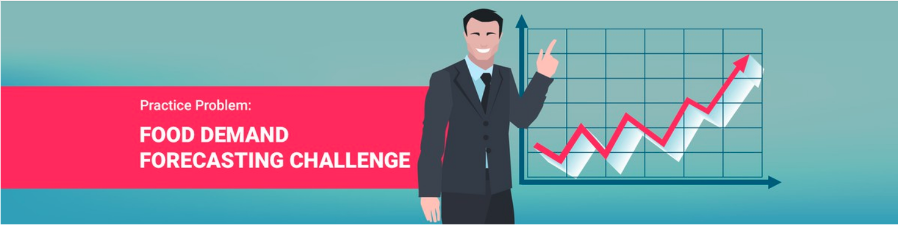
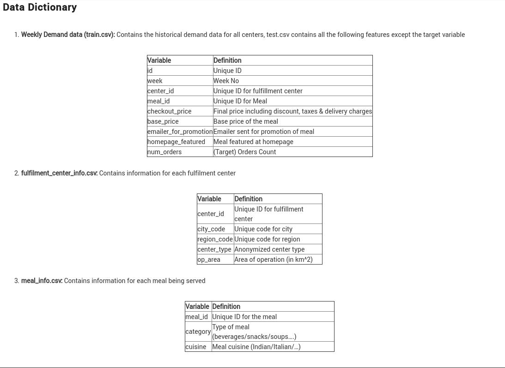

#  Food Demand Forecasting Challenge

## About Food Demand Forecasting Challenge

Demand forecasting is a key component to every growing online business. Without proper demand forecasting processes in place,it can be nearly impossible to have the right amount of stock on hand at any given time. A food delivery service has to dealwith a lot of perishable raw materials which makes it all the more important for such a company to accurately forecast daily and weekly demand.

Too much invertory in the warehouse means more risk of wastage,and not enough could lead to out-of-stocks - and push customers to seek solutions from your competitors.
In this challenge, get a taste of demand forecasting challenge using a real datasets.

## Problem Statement

Your client is a meal delivery company which operates in multiple cities.They have various fulfillment centers in these cities for dispatching meal orders to their customers. The client wants you to help these centers with demand forecasting for upcoming weeks so that these centers will plan the stock of raw materials accordingly.
The replenishment of majority of raw materials is done on weekly basis and since the raw material is perishable,the procurement planning is of utmost importance.Secondly, staffing of the centers is also one area wherein accurate demand forecasts are really helpful.Given the following information,the task is to predict the demand for the next 10 weeks(Weeks: 146-155) for the center-meal combinations in the test set:

* **Historical data of demand for a product-center combination(Weeks:1 to 145)**
* **Product(Meal) features such as category,sub-category,current price and discount**
* **Information for fulfillment center like center area, city information etc.**

### Evaluation Metric

Submissions are evaluated on **Root Mean Square Error (RMSE)** between the predicted probability and the observed target.
 

### Public and Private Split
Test data is further randomly divided into **Public (30%) and Private (70%)** data.
Your initial responses will be checked and scored on the Public data.
The final rankings would be based on your private score which will be published once the [competition](https://datahack.analyticsvidhya.com/contest/genpact-machine-learning-hackathon-1/) is over

### Leaderboard 
* **[Public LB](https://datahack.analyticsvidhya.com/contest/genpact-machine-learning-hackathon-1/lb)** : **21/885 Rank**

